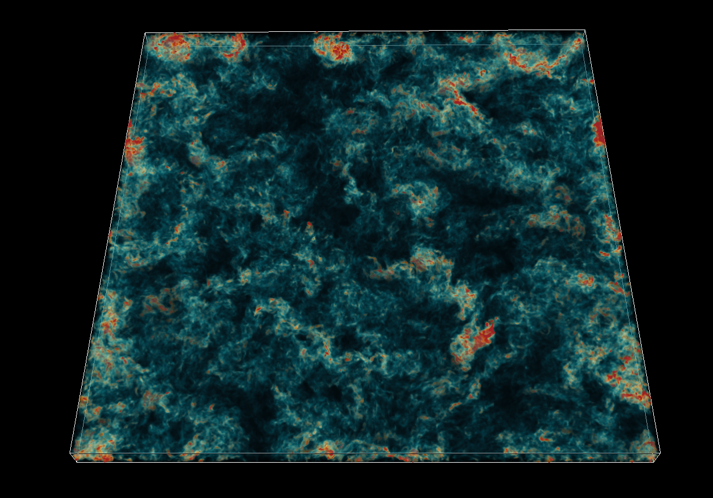

## Paraview-Colormap-Generator
Code to generate a Colormap.xml file compatible with Paraview, using a custom list of hexadecimal colour values. 

### Example usage:

```python
#-- Specify a name for the colormap
cmapName = "Lava2" 

#-- Provide a list of colours in hexadecimal, atleast 2, with or without the leading "#" (made consistent later)
cols	 = ["03071e","6a040f","9d0208","d00000","e85d04","faa307","ffba08","fde7ae"]

#-- Running this script will create and save "Lava2.xml" in a Folder called "Colormaps"
```

### Some nice Colormaps using palettes from [Coolors](https://coolors.co/):

1. "**WesAndy**" : ["001219","005f73","0a9396","94d2bd","e9d8a6","ee9b00","ca6702","bb3e03","ae2012","9b2226"]
2. "**Aurora**" : ["d9ed92","b5e48c","99d98c","76c893","52b69a","34a0a4","168aad","1a759f","1e6091","184e77"]
3. "**Lava**" :  ["03071e","370617","6a040f","9d0208","d00000","dc2f02","e85d04","f48c06","faa307","ffba08"]
4. "**Lapis**" : ["05668d","028090","00a896","02c39a","b5e7b5", "d3edb9"]
5. "**Aqua**" : ["073b4c","00b4d8","b5e48c","ffe8d6"]

### Useful workflow when using the Coolors website:
1. Start with https://coolors.co/palettes
2. Select a palette and then "Open in Generator" (click on the three dots next to the palette)
3. Tweak colours
4. Export (Ctrl + E) -> Code -> Double click and copy the "Array" representation
5. Paste the Array below, together with a name and run the script

**Tip:** It is often nice to start with *two simple colours* and then add some intermediate/end shades. 

###  Note on Paraview usage:
Once a rendering is done, open the "Colormap selector" and "Load" the generated colormap. Depending on the version of Paraview, the new map may/may not show up immediately - latter if the current colormaps in view are set to "Default". In this case, change "Default" to "All", which will show the new map towards the end. You can select and click on "Show this map in Default", when applying the colormap, to have it show up front.



**Eg.** Rendering of a field from the [Johns Hopkins Turbulence Database](http://turbulence.pha.jhu.edu/), using the Wes Anderson inspired colormap.

*In honour of the [Hue-Manatee](https://tenor.com/view/manatee-rainbow-nature-joke-funny-gif-5660562)*
